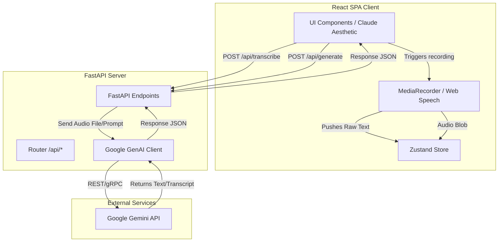

# ClearDraft — Technical Requirements Document (TRD)

**Version:** 1.0  
**Date:** June 2026  
**Status:** Draft  
**Reference PRD:** [PRD.md](file:///d:/Projects/ClearDraft/documentation/PRD.md)

---

## 1. Introduction & Objectives

ClearDraft is an AI-powered voice and text transcription application designed to convert raw, unstructured thoughts (spoken or typed) into polished, professional, and well-structured outputs. This document outlines the technical design, system architecture, API endpoints, tool recommendations, and development practices required to build and deploy ClearDraft.

### Core Architecture Goal
- Build a fast, lightweight, and modern full-stack web application.
- Deliver an off-white, minimal Claude.ai-like user experience.
- Utilize a cost-free, high-performance LLM API (Google Gemini 1.5 Flash).
- Implement efficient audio capture, file upload, and text manipulation workflows.

---

## 2. Recommended Tech Stack & Tools

To satisfy the user requirements, the application will use the following technology stack and auxiliary tools:

### 2.1 Core Stack
*   **Frontend Framework:** React (bootstrapped with Vite for fast HMR and optimized production builds).
*   **Styling:** Tailwind CSS (for utility-first, rapid, and fully responsive layout design).
*   **Backend Framework:** Python + FastAPI (asynchronous, high performance, automatic OpenAPI documentation).
*   **ASGI Server:** Uvicorn (to run the FastAPI backend server).
*   **LLM Service:** Google Gemini API (specifically `gemini-2.5-flash` model, using the free tier API key).

### 2.2 Suggested Auxiliary Tools & Libraries
#### Frontend (React)
*   **Icons:** `lucide-react` (clean, stroke-based icons matching the minimal Claude aesthetic).
*   **State Management:** `zustand` (minimal, boilerplate-free state management library, ideal for managing global UI states like tabs, recording, audio files, and output).
*   **HTTP Client:** `axios` or native `fetch` (Axios preferred for robust request cancellation, upload progress, and interceptors).
*   **Audio Recording:** HTML5 MediaRecorder API (native browser API, avoiding heavy npm dependencies).
*   **Speech Recognition:** Web Speech API (for real-time client-side transcription fallback).

#### Backend (FastAPI)
*   **LLM SDK:** `google-genai` or `google-generativeai` (official Google SDK for Python to interact with the Gemini API).
*   **File Uploads:** `python-multipart` (required by FastAPI to parse multipart/form-data for audio file uploads).
*   **Environment Variables:** `python-dotenv` (for loading API keys from `.env` files securely).
*   **Audio Handling (Optional/Recommended):** `pydub` + `ffmpeg` (for local audio duration checks and verification before dispatching to the LLM/transcription API, or formatting if browser audio formats are non-standard).

---

## 3. System Architecture & Data Flow

The application consists of a decoupled Single Page Application (SPA) frontend and a RESTful backend API. 



### 3.1 Input Formats & Processing Logic
1.  **Text Input:** Handled completely client-side in a textarea, stored in state, and sent directly to `/api/generate` on submission.
2.  **Live Voice Recording:**
    *   *Path A (Web Speech API):* Conducted entirely client-side. The browser transcribes in real-time. The text is captured, populated in the raw input box, and can be reviewed/edited before hitting `/api/generate`.
    *   *Path B (MediaRecorder API):* Captures audio as a WebM/WAV blob. When recording stops, the blob is sent via form-data to `/api/transcribe`, which transcribes it and returns the raw text.
3.  **Upload Audio File:** User drops a file (`.mp3`, `.wav`, `.m4a`, etc. up to 25MB). The client uploads it to `/api/transcribe` via multipart/form-data. The backend transcribes it and returns the raw text to the UI for user review.

---

## 4. API Specification

FastAPI will serve the REST endpoints. The API will be stateless and run on port `8000` by default.

### 4.1 `POST /api/transcribe`
Transcribes an uploaded audio file using Gemini's native audio understanding or a dedicated library.

*   **Content-Type:** `multipart/form-data`
*   **Request Payload:**
    *   `file`: Binary audio file (Max 25MB. Supported formats: `audio/mpeg`, `audio/wav`, `audio/webm`, `audio/x-m4a`).
*   **Response Payload (`200 OK`):**
    ```json
    {
      "success": true,
      "transcript": "The raw transcribed text from the audio file...",
      "duration_seconds": 45.2,
      "filename": "recording.wav"
    }
    ```
*   **Error Responses:**
    *   `400 Bad Request`: File too large (>25MB) or unsupported format.
    *   `500 Internal Server Error`: LLM/Transcription service failure.

### 4.2 `POST /api/generate`
Processes raw text according to a specified Output Mode, applying custom system prompts and returning formatted text.

*   **Content-Type:** `application/json`
*   **Request Payload:**
    ```json
    {
      "text": "The raw, unstructured thoughts or transcript...",
      "mode": "email", 
      "tone": "formal",
      "additional_instructions": "Keep the signature generic."
    }
    ```
    *   `mode` options: `transcribe` | `documentation` | `email` | `linkedin` | `brainstorm` | `meeting_notes` | `formal_letter` | `story` | `todo` | `prompting`
    *   `tone` options (optional): `formal` | `semi-formal` | `friendly`
*   **Response Payload (`200 OK`):**
    ```json
    {
      "success": true,
      "mode": "email",
      "output": "Subject: ...\n\nDear ...\n\n[Polished Content]\n\nBest regards,\n..."
    }
    ```
*   **Error Responses:**
    *   `400 Bad Request`: Missing raw text or invalid output mode.
    *   `500 Internal Server Error`: Gemini API call failed.

---

## 5. Gemini API Integration & Prompt Engineering

The integration will use the `gemini-2.5-flash` model, which features a massive 1-million-token context window and native audio processing capabilities. 

### 5.1 Native Audio Transcription with Gemini 1.5 Flash
Since we are using the free Gemini API, we can bypass a separate Whisper API by sending audio files directly to Gemini! Gemini 1.5 Flash supports audio inputs natively.
*   **Mechanism:** The FastAPI backend receives the audio file, uploads it/passes it as raw bytes along with a mime-type parameter directly to Gemini 1.5 Flash with a prompt instructing it to: *"Transcribe the audio accurately. Keep all verbal statements verbatim but remove filler words (um, uh, like). Do not add comments or summaries, output only the clean transcript."*
*   **Benefit:** This provides a 100% free transcription pipeline that handles multiple audio extensions out-of-the-box.

### 5.2 Prompt Engineering Config (`prompts.py`)
The backend will maintain a mapping of output modes to system instructions.

```python
PROMPT_TEMPLATES = {
    "transcribe": (
        "You are an expert transcription assistant. Take the raw transcription "
        "and clean it up. Add appropriate punctuation, correct capitalization, "
        "and structure it into paragraphs. Do not add, omit, or rephrase any ideas. "
        "Remove stuttering and filler words like 'um', 'uh', and 'like'."
    ),
    "documentation": (
        "You are a professional technical writer. Convert the user's raw thoughts into "
        "highly structured technical documentation. Use markdown syntax for headings (#, ##), "
        "bullet points, bold text, and numbered lists to make it readable. Do not wrap the output "
        "in markdown code blocks unless requested. Make sure sections are logical and professional."
    ),
    "email": (
        "You are a professional communications assistant. Convert the user's raw thoughts "
        "into a structured email. Provide a subject line starting with 'Subject: ', a professional greeting, "
        "well-organized body paragraphs (using the specified tone: {tone}), and an appropriate closing. "
        "If no tone is specified, default to a balanced professional tone."
    ),
    "linkedin": (
        "You are a LinkedIn content creator. Rewrite the raw thoughts into a highly engaging "
        "LinkedIn post. Use an attention-grabbing hook at the beginning, break up text into readable single "
        "paragraphs or lines, incorporate relevant emojis naturally, and end with a clear Call to Action (CTA) "
        "and 3-5 relevant hashtags. Keep it professional yet conversational."
    ),
    "brainstorm": (
        "You are a product management and brainstorming assistant. Expand the user's raw, fragmented ideas "
        "into a comprehensive brainstorming document. Group the concepts into logical categories, elaborate "
        "on potential opportunities or considerations, and list 3-5 high-value constructive suggestions "
        "the user might have missed."
    ),
    "meeting_notes": (
        "You are an executive assistant. Formulate standard meeting notes from the provided text. "
        "Structure the output with the following sections:\n"
        "- Summary: Brief overview of the discussion\n"
        "- Attendees: List people mentioned (or state 'Not specified')\n"
        "- Key Discussion Points: Detailed bullet points\n"
        "- Decisions Made: Decisions agreed upon\n"
        "- Action Items: Tasks with owners (if mentioned) and checkboxes [ ]"
    ),
    "formal_letter": (
        "You are a formal correspondence editor. Convert the input into a standard formal business letter "
        "layout. Include placeholders for the date, sender address, recipient address, and subject line. "
        "Draft the letter body using formal, polite language, and conclude with a professional sign-off (e.g., Sincerely)."
    ),
    "story": (
        "You are a creative writer. Take the raw narrative outline or thoughts and rewrite them into "
        "an engaging, creative short story. Focus on narrative flow, descriptive language, sensory details, "
        "and natural pacing. Keep the original intent and characters but elevate the vocabulary and immersion."
    ),
    "todo": (
        "You are a personal productivity assistant. Extract all explicit and implicit tasks, commitments, "
        "and action items from the raw text. Format them as a clean, prioritized markdown checkbox checklist (- [ ]). "
        "If owners or deadlines are mentioned in the text, attribute them next to the task."
    ),
    "prompting": (
        "You are an expert prompt engineer. Take the user's raw idea, goal, or description and generate "
        "a highly optimized, ready-to-use system/user prompt block for other AI models (ChatGPT, Claude, Midjourney). "
        "Format the output strictly with the following sections:\n"
        "- Role & Context\n"
        "- Instructions/Tasks\n"
        "- Constraints & Boundaries\n"
        "- Output Format Specification\n"
        "Output only the ready-to-copy prompt. Do not add any introduction or explanations."
    )
}
```

---

## 6. Frontend UI Design Details (Claude.ai Inspired)

The user interface will be built to look premium, minimal, and highly professional.

### 6.1 UI Styling Spec
*   **Colors:**
    *   Primary Background: `#FAF9F6` (Warm off-white) or `#FAFAF8`
    *   Surface Containers (Cards): `#FFFFFF`
    *   Primary Text: `#111111` (Deep charcoal)
    *   Secondary Text: `#666666` (Medium gray)
    *   Subtle Borders: `#E5E5E0` (Ultra-light warm gray)
    *   Accent Color (Interactive): `#D97706` / `#B45309` (Warm amber/bronze or sleek black)
*   **Typography:** Google Font `Outfit` or `Inter`, fallback to system sans-serif.
*   **Transitions:** Smooth hover effects (`transition-all duration-200 ease-in-out`) on button highlights and input focuses.
*   **Animations:**
    *   Pulsing recording indicator (`animate-ping` on a red/amber indicator).
    *   Shimmer/skeleton loader for generating state.

### 6.2 State Store Structure (`useAppStore.js`)
We will manage state using Zustand to coordinate operations:
*   `activeTab`: `'voice'` | `'text'` | `'upload'`
*   `selectedMode`: String (e.g., `'email'`)
*   `tone`: `'formal'` | `'semi-formal'` | `'friendly'`
*   `rawText`: String (manually written or Web Speech API output)
*   `audioFile`: File object (uploaded file or recorded voice blob)
*   `transcription`: String (from server transcription API)
*   `outputContent`: String (the AI polished result)
*   `isRecording`: Boolean
*   `isProcessing`: Boolean (global loading flag)
*   `isEditing`: Boolean (flag for enabling contenteditable / textarea mode in output panel)

---

## 7. Safety, Limits, and Edge Cases

1.  **Audio Processing Size Limits:** Enforcement of `<25MB` uploads on both frontend and backend. Backend will use FastAPI `UploadFile` details to inspect content length.
2.  **Web Speech API Compatibility:** Web Speech API only works fully in Chrome and Safari. A fallback warning must be displayed if the API is missing, steering the user to use "Upload Audio File" or standard recording + backend transcription.
3.  **API Rate Limiting (Free Tier):** Google Gemini free tier has a rate limit (typically 15 RPM / 1 million TPM). In case of rate limiting (`429 Too Many Requests`), the backend should catch the exception and return a friendly error message advising the user to wait a moment.
4.  **Audio Formatting Compatibility:** MediaRecorder captures audio in browser-native container formats (like WebM or OGG). Gemini supports OGG, WebM, WAV, and MP3. Therefore, direct transmission of the WebM blob works natively without transcode overhead.

---

## 8. Next Steps & Recommended Verifications
- Test Gemini API credentials locally via a simple test script.
- Verify browser support for `webkitSpeechRecognition`.
- Setup CORS middleware in FastAPI to allow localhost cross-origin requests.
